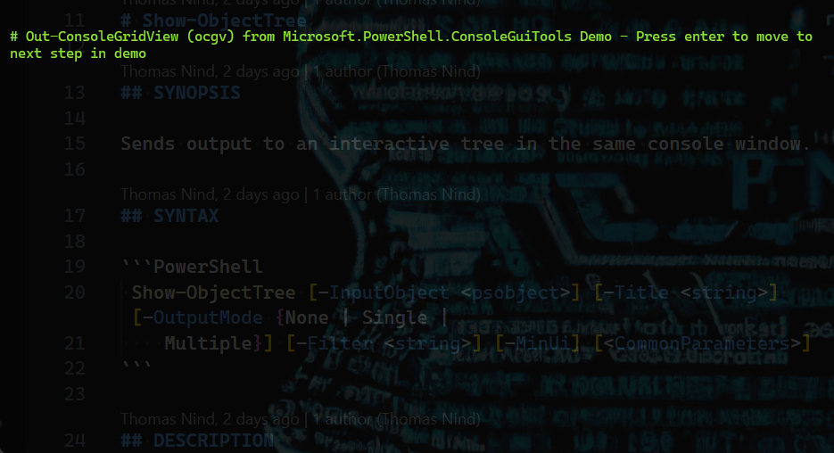

# PSTui — PowerShell TUI tools

> ## 🚧 Work in progress
>
> **PSTui is the [gui-cs](https://github.com/gui-cs) community continuation of
> Microsoft's `Microsoft.PowerShell.ConsoleGuiTools`.**
>
> In [ConsoleGuiTools#275](https://github.com/PowerShell/ConsoleGuiTools/issues/275)
> the PowerShell team declared `Microsoft.PowerShell.ConsoleGuiTools`
> feature-complete at **0.7.7** (its final release), announced the repo would be
> **archived**, and encouraged a community-maintained fork — which they said they
> would point users to. This is that fork.
>
> It already incorporates the **Terminal.Gui v2** modernization from
> [ConsoleGuiTools#267](https://github.com/PowerShell/ConsoleGuiTools/pull/267)
> (approved upstream but never merged before the project was sunset): both
> cmdlets rebuilt on Terminal.Gui v2, a test suite, and a bump to 1.0.0.
>
> **This is an active WIP.** The code builds on the v2 work, but the rebrand to
> the `PSTui` name (module id, namespaces, packaging, PSGallery release) is not
> finished. Names, package ids, and APIs may change before the first release.
> See **[`PLAN.md`](PLAN.md)** for the full re-release strategy and status.
>
> Existing `Out-ConsoleGridView` (`ocgv`) and `Show-ObjectTree` (`shot`) users:
> these cmdlets keep their names — your scripts and muscle memory carry forward.

This repo contains the `Out-ConsoleGridView` and `Show-ObjectTree`
PowerShell Cmdlets — interactive terminal UI (TUI) experiences for the
pipeline, built on [Terminal.Gui](https://github.com/gui-cs/Terminal.Gui).

_Note:_ A module named `Microsoft.PowerShell.GraphicalTools` used to be built and published out of this repo, but per [#101](https://github.com/PowerShell/ConsoleGuiTools/issues/101) it is deprecated and unmaintained until such time that it can be rewritten on top of [.NET MAUI](https://devblogs.microsoft.com/dotnet/introducing-net-multi-platform-app-ui/).

## Installation

```powershell
Install-Module PSTui
```

## Migrating from `Microsoft.PowerShell.ConsoleGuiTools`

PSTui is a drop-in continuation of Microsoft's (now archived)
`Microsoft.PowerShell.ConsoleGuiTools`. The cmdlets and aliases are unchanged,
so existing scripts keep working — you only change the module you install:

```powershell
# Old (Microsoft — archived, final release 0.7.7)
Install-Module Microsoft.PowerShell.ConsoleGuiTools

# New (gui-cs community continuation)
Install-Module PSTui
```

|              | `Microsoft.PowerShell.ConsoleGuiTools` | `PSTui`                          |
| ------------ | -------------------------------------- | -------------------------------- |
| Cmdlets      | `Out-ConsoleGridView`, `Show-ObjectTree` | **same**                       |
| Aliases      | `ocgv`, `shot`                         | **same**                         |
| Engine       | Terminal.Gui v1                        | Terminal.Gui v2                  |
| PowerShell   | 7.2+                                   | 7.6+                             |
| Maintainer   | Microsoft (archived)                   | [gui-cs](https://github.com/gui-cs) community |

Because both modules export the **same** cmdlet names, avoid installing both at
once — `Import-Module` will report ambiguous commands. If you have the old
module, remove it first:

```powershell
Uninstall-Module Microsoft.PowerShell.ConsoleGuiTools
Install-Module PSTui
```

### Behavior changes (from the Terminal.Gui v2 rewrite, [ConsoleGuiTools#267](https://github.com/PowerShell/ConsoleGuiTools/pull/267))

* `Out-ConsoleGridView` renders **inline** by default; use `-FullScreen` for the
  old alternate-buffer behavior.
* Objects **stream** into the table as they arrive from the pipeline.
* Pressing <kbd>Enter</kbd> with no explicit selection returns the **focused** row.
* New parameters: `-Driver`, `-FullScreen`, `-Search`, `-Focus`, `-AllProperties`.
* Removed: `-UseNetDriver` (replaced by `-Driver`).

## Features

* [`Out-ConsoleGridView`](docs/PSTui/Out-ConsoleGridView.md) - Send objects to an interactive table view with column headers, horizontal scrolling, streaming, sorting, and native multi-selection.
* [`Show-ObjectTree`](docs/PSTui/Show-ObjectTree.md) - Send objects to a tree view window for interactive filtering and sorting.

* Cross-platform - Works on any platform that supports PowerShell 7.6+.
* Interactive - Use the mouse and keyboard to interact with the grid or tree view.
* Filtering - Filter the data using the built-in filter box.
* Sorting - Sort the data by clicking on the column headers.
* Multiple Selection - Select multiple items and send them down the pipeline.
* Customizable - Customize the grid view window with the built-in parameters.



## Examples

### Example 1: Output processes to a grid view

```PowerShell
Get-Process | Out-ConsoleGridView
```

This command gets the processes running on the local computer and sends them to a grid view window.

### Example 2: Use a variable to output processes to a grid view

```PowerShell
$P = Get-Process
$P | Out-ConsoleGridView -OutputMode Single
```

This command also gets the processes running on the local computer and sends them to a grid view window.

The first command uses the Get-Process cmdlet to get the processes on the computer and then saves the process objects in the $P variable.

The second command uses a pipeline operator to send the $P variable to **Out-ConsoleGridView**.

By specifying `-OutputMode Single` the grid view window will be restricted to a single selection, ensuring no more than a single object is returned.

### Example 3: Display a formatted table in a grid view

```PowerShell
Get-Process | Select-Object -Property Name, WorkingSet, PeakWorkingSet | Sort-Object -Property WorkingSet -Descending | Out-ConsoleGridView
```

This command displays a formatted table in a grid view window.

It uses the Get-Process cmdlet to get the processes on the computer.

Then, it uses a pipeline operator (|) to send the process objects to the Select-Object cmdlet.
The command uses the **Property** parameter of **Select-Object** to select the Name, WorkingSet, and PeakWorkingSet properties to be displayed in the table.

Another pipeline operator sends the filtered objects to the Sort-Object cmdlet, which sorts them in descending order by the value of the **WorkingSet** property.

The final part of the command uses a pipeline operator (|) to send the formatted table to **Out-ConsoleGridView**.

You can now use the features of the grid view to search, sort, and filter the data.

### Example 4: Save output to a variable, and then output a grid view

```PowerShell
($A = Get-ChildItem -Path $pshome -Recurse) | Out-ConsoleGridView
```

This command saves its output in a variable and sends it to **Out-ConsoleGridView**.

The command uses the Get-ChildItem cmdlet to get the files in the Windows PowerShell installation directory and its subdirectories.
The path to the installation directory is saved in the $pshome automatic variable.

The command uses the assignment operator (=) to save the output in the $A variable and the pipeline operator (|) to send the output to **Out-ConsoleGridView**.

The parentheses in the command establish the order of operations.
As a result, the output from the Get-ChildItem command is saved in the $A variable before it is sent to **Out-ConsoleGridView**.

### Example 5: Output processes for a specified computer to a grid view

```PowerShell
Get-Process -ComputerName "Server01" | ocgv -Title "Processes - Server01"
```

This command displays the processes that are running on the Server01 computer in a grid view window.

The command uses `ocgv`, which is the built-in alias for the **Out-ConsoleGridView** cmdlet, it uses the _Title_ parameter to specify the window title.

### Example 6: Define a function to kill processes using a graphical chooser

```PowerShell
function killp { Get-Process | Out-ConsoleGridView -OutputMode Single -Filter $args[0] | Stop-Process -Id {$_.Id} }
killp note
```

This example shows defining a function named `killp` that shows a grid view of all running processes and allows the user to select one to kill it.

The example uses the `-Filter` paramter to filter for all proceses with a name that includes `note` (thus highlighting `Notepad` if it were running. Selecting an item in the grid view and pressing `ENTER` will kill that process.

### Example 7: Use F7 as "Show Command History"

Add [gui-cs/F7History](https://github.com/gui-cs/F7History) to your Powershell profile.

Press `F7` to see the history for the current PowerShell instance

Press `Shift-F7` to see the history for all PowerShell instances.

Whatever you select within `Out-ConsoleGridView` will be inserted on your command line.

Whatever was typed on the command line prior to hitting `F7` or `Shift-F7` will be used as a filter.

### Example 8: Output processes to a tree view

```PowerShell
Get-Process | Show-ObjectTree
```

This command gets the processes running on the local computer and sends them to a tree view window.

Use right arrow when a row has a `+` symbol to expand the tree. Left arrow will collapse the tree.

### Example 9: Output processes to a grid view with streaming

```PowerShell
Get-Process | Out-ConsoleGridView
```

This command gets the processes running on the local computer and sends them to an interactive table with column headers. The table appears as soon as the first object arrives — rows stream in as the pipeline executes.

### Example 10: Search for a specific row in the grid view

```PowerShell
Get-Service | ocgv -Search "wuauserv" -Focus Filter
```

This command displays all services in a grid view, positions the cursor on the first row matching "wuauserv", and starts with focus in the filter field.

## Development

### 1. Install PowerShell 7.6+

Install PowerShell 7.6+ with [these instructions](https://github.com/PowerShell/PowerShell#get-powershell).

### 2. Clone the GitHub repository

```powershell
git clone https://github.com/gui-cs/PSTui.git
```

### 3. Install [Invoke-Build](https://github.com/nightroman/Invoke-Build)

```powershell
Install-Module InvokeBuild -Scope CurrentUser
```

Now you're ready to build the code.  You can do so in one of two ways:

### 4. Building the code from PowerShell

```powershell
pushd ./PSTui
Invoke-Build Build
popd
```

From there you can import the module that you just built for example (start a fresh `pwsh` instance first so you can unload the module with an `exit`; otherwise building again may fail because the `.dll` will be held open):

```powershell
pwsh
Import-Module ./module/PSTui
```

And then run the cmdlet you want to test, for example:

```powershell
Get-Process | Out-ConsoleGridView
exit
```

> NOTE: If you change the code and rebuild the project, you'll need to launch a
> _new_ PowerShell process since the DLL is already loaded and can't be unloaded.

### 5. Debugging in Visual Studio Code

```powershell
code ./PSTui
```

Build by hitting `Ctrl-Shift-B` in VS Code.

Set a breakpoint and hit `F5` to start the debugger.

Click on the VS Code "TERMINAL" tab and type your command that starts `Out-ConsoleGridView`, e.g.

```powershell
ls | ocgv
```

Your breakpoint should be hit.

## Contributions Welcome

We would love to incorporate community contributions into this project.  If
you would like to contribute code, documentation, tests, or bug reports,
please read the [development section above](https://github.com/gui-cs/PSTui#development)
to learn more.

## PSTui Architecture

`PSTui` consists of 2 .NET Projects:

* PSTui - Cmdlet implementation for Out-ConsoleGridView and Show-ObjectTree
* PSTui.Models - Contains data contracts between the TUI & Cmdlet

_Note:_ Previously, this repo included `Microsoft.PowerShell.GraphicalTools` which included the Avalonia-based `Out-GridView` (implemented in `.\Microsoft.PowerShell.GraphicalTools` and `.\OutGridView.Gui`). These components have been deprecated (see note above).

## Maintainers

* [Andy Jordan](https://andyleejordan.com) - [@andyleejordan](https://github.com/andyleejordan)
* [Tig Kindel](https://www.kindel.com) - [@tig](https://github.com/tig)

Originally authored by [Tyler Leonhardt](http://twitter.com/tylerleonhardt).

## License

This project is [licensed under the MIT License](LICENSE.txt).

## Code of Conduct

Please see our [Code of Conduct](.github/CODE_OF_CONDUCT.md) before participating in this project.

## Security Policy

For any security issues, please see our [Security Policy](.github/SECURITY.md).
